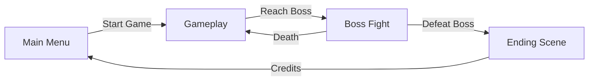
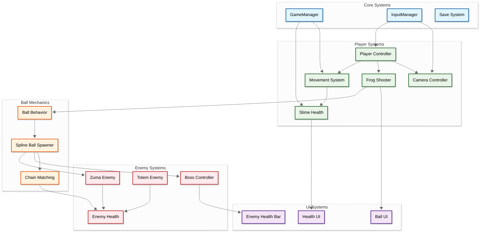
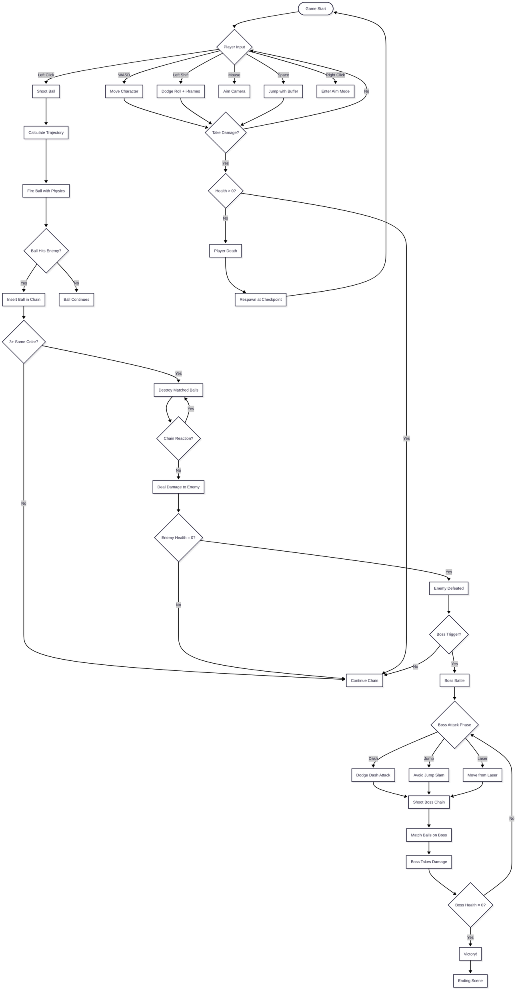
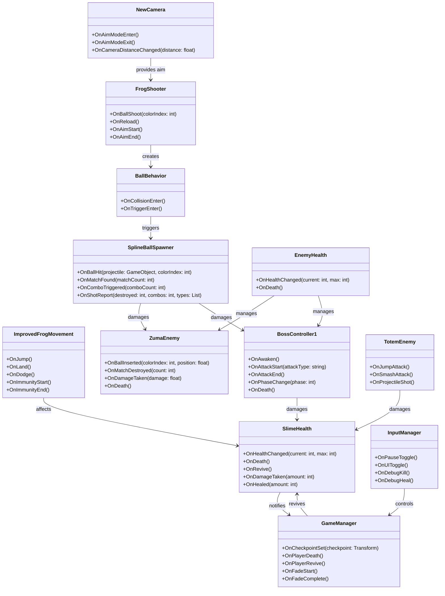

## Developer & Contributions
**Alerica** (Game Designer)  
**adxze** (Game Programmer)  
**Albert** (Game Artist)

## About
Zumi The Slime is a 3D action adventure game where players control a slime character with unique shooting mechanics inspired by Zuma gameplay. Navigate through challenging levels, defeat enemies using ball matching mechanics along spline paths, and face off against powerful bosses. Master movement abilities like jumping, dodging, and precise aiming while strategically shooting colored balls to create matches and damage enemies.

 

## Key Features

**Dynamic Ball Shooting System**: Aim and shoot colored balls with realistic physics, trajectory prediction, and gravity control. Match three or more balls of the same color along enemy spline paths to deal massive damage through chain reactions and combos.

**Advanced Movement Mechanics**: Fluid character control with jumping, air control, dodge rolls with i frames, squash and stretch animations, and responsive ground detection

**Epic Boss Battles**: Face challenging bosses with multiple attack patterns including dash attacks, jump slams, and laser beams. Learn attack telegraphs through visual indicators and precise timing to survive intense encounters.

<table>
<tr>
<td align="center" width="50%">
<strong>Ball Matching Mechanics</strong> 
Shoot colored balls to create matches along spline paths

</td>
<td align="center" width="50%">
<strong>Boss Combat</strong> 
Dynamic boss fights with telegraphed attacks

</td>
</tr>
</table>

## Scene Flow

## Layer / Module Design

## Modules and Features

The 3D action-adventure gameplay with Zuma-inspired ball-matching mechanics, advanced movement system, boss battles, and comprehensive health management is powered by an extensive Unity C# scripting system.

| 📂 Name | 🎬 Scene | 📋 Responsibility |
|---------|----------|-------------------|
| **GameManager** | **All Scenes** | - Manage game state and checkpoint system - Handle player death and respawn - Control fade effects and scene transitions - Track death/revive statistics |
| **InputManager** | **Gameplay** | - Handle keyboard input for debug functions - Toggle UI visibility (F12) - Quick kill/heal commands (F11/F10) - Manage pause menu and cursor lock |
| **FrogShooter** | **Gameplay** | - Control ball shooting mechanics - Calculate trajectory with gravity - Manage current and next ball queue - Handle aim reticle and visual feedback - Play shooting and reload sound effects |
| **ImprovedFrogMovement** | **Gameplay** | - Handle player movement with hopping mechanics - Implement jump with coyote time and jump buffering - Execute dodge roll with immunity frames - Apply squash and stretch animations - Manage ground detection and air control |
| **NewCamera** | **Gameplay** | - Control third-person camera with Cinemachine - Switch between normal and aim camera modes - Handle mouse look and camera rotation - Manage camera distance with scroll wheel - Rotate player when aiming or shooting |
| **SlimeHealth** | **Gameplay** | - Track player health (current/max) - Handle damage and healing - Trigger death and revive events - Update health UI in real-time - Manage player death state |
| **ZumaEnemy** | **Gameplay** | - Generate spiral spline paths for ball chain - Spawn and manage colored ball chain - Handle ball insertion from player shots - Detect color matches (3+ balls) - Apply damage to enemy when matches occur - Destroy matched balls with effects |
| **SplineBallSpawner** | **Gameplay** | - Advanced spline-based ball chain system - Handle ball hit detection and insertion - Process chain reactions and combos - Manage knockback and snap-back animations - Calculate match detection along splines - Report damage to enemy health |
| **BossController1** | **Boss Fight** | - Control boss AI state machine - Execute dash attack with windup and indicators - Perform jump slam attack with AOE damage - Fire laser beam with charge time - Handle boss awakening sequence - Manage boss health and death - Play attack sounds and effects |
| **BossAwakeTrigger** | **Boss Fight** | - Detect player entry to boss arena - Activate boss awakening sequence - Enable boundary objects - Trigger one-time boss encounter |
| **BossContainer** | **Boss Fight** | - Constrain boss within arena bounds - Prevent boss from leaving battle area - Display arena boundaries in editor |
| **TotemEnemy** | **Gameplay** | - Execute jump attacks toward player - Perform smash attack with ground AOE - Display smash indicators for telegraphing - Shoot projectiles when player is far - Rotate to face player target |
| **EnemyHealth** | **Gameplay** | - Track enemy health points - Handle damage from ball matches - Update enemy health bar UI - Trigger death and cleanup on zero health |
| **NewMovement** | **Gameplay** | - Alternative movement controller - Camera-relative directional input - Jump mechanics with buffering - Squash/stretch visual feedback - Ground check and air control |
| **CameraIdleJiggle** | **Gameplay** | - Add subtle camera movement - Create living camera feel - Use Perlin noise for smoothness |

 

## Game Flow Chart

 

## Event Signal Diagram

 

## Play The Game
<a href="https://alerica.itch.io/127-liminal-collective-student-zumi-the-slime">Play Now on itch.io</a>

 

## Installation & Setup
1. Clone this repository
2. Open the project in Unity (6 or later recommended)
3. Open the main gameplay scene
4. Press Play to start testing

## Controls
- **WASD** - Movement
- **Space** - Jump
- **Left Shift** - Dodge Roll
- **Mouse** - Look/Aim
- **Left Click** - Shoot Ball
- **Right Click** - Aim Mode
- **Scroll Wheel** - Adjust Camera Distance
- **Escape** - Pause Menu
- **F10** - Heal (Debug)
- **F11** - Kill Player (Debug)
- **F12** - Toggle UI (Debug)

## Credits
Game developed as a student project by the 127 Liminal Collective team.
